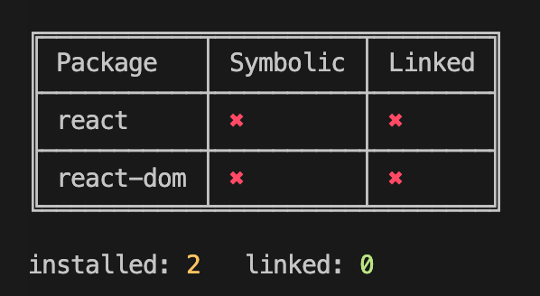
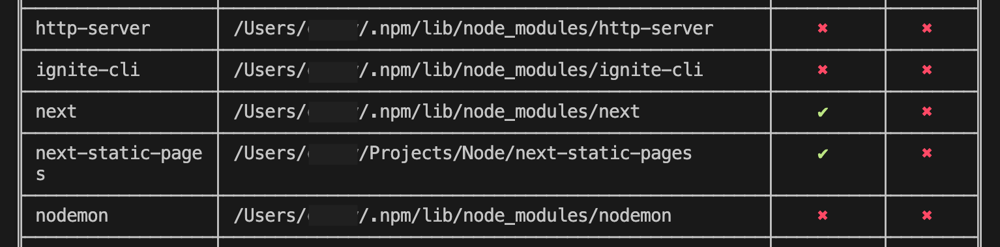

# Kupler (Experimental)  

Utility for managing globally linked packages. One of the issues you run into with packages like [React](https://reactjs.org) is that you cannot run multiple instances of it. This requires you to link your library or other package to the same instance of react. 

The issues arises when you forget where you linked it. There are occassions where even running <code>--force</code> to remove the link is problematic. 

Kupler simply provides a management of packages that are going to be used for linking to.

### Doesn't NPM Do This Already?

Yeah pretty much, basically all we're doing here is adding a few helpers to better understand what's linked and where, and it ensures thes packages are always linked from one specific place. Again this prevents issues where we link a package then move it, delete or whatever. Kupler just makes this all a little cleaner. 

## Getting Started

Globally install the package. 

```sh
$ npm install kupler -g
```

## Install Packages

You can run this command from anywhere the package will only be installed in Kupler's node modules.

NOTE: to update/upgrade packages simply run <code>kupler upgrade</code> however you may wish to uninstall and then reinstall for greater control.

```sh
$ kupler install react
```

## Make the Package Global

This is the same as if you navigated to the React directory within Kupler's node_modules and ran <code>npm link</code>

```sh
$ kupler link react
```

## Use in Project

Once the above steps have been completed you can now use the linked package in any other package ensure your library and your primary package are using the same package.

```sh
$ cd /some/other/project/dir
$ kupler use react
```

> REMINDER: linking and unlinking are used in Kupler to link it's installed packages, the "use" and "unuse commands are for using those linked packages in another package!

## Show Status 

To show the linked package status run the following:

```sh
kupler status 
# or
kupler status -g
```

You should see something similar to the below:



You can also show the status of all globally linked packages. Just add the **-g** or **--global** flag. Since we are looking at global packages we provide the path where they are linked. There is no need to show this path without the --global flag as we know they are only linked locally.



## Npm vs Yarn

Kupler works with either. If you install using [Yarn](https://yarnpkg.com) then Kupler will use Yarn otherwise it will use [Npm](https://npmjs.org)

